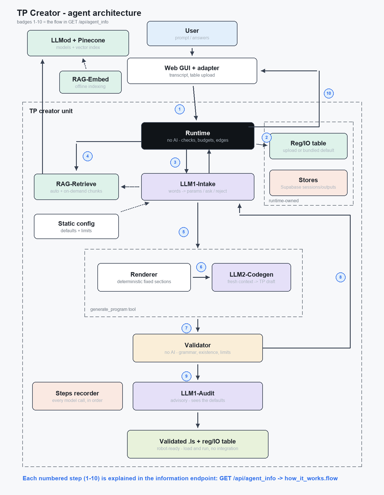

# TP Creator

Plain words in → **validated FANUC TP program** out.

TP Creator is an AI agent that writes robot programs (.LS files) for a FANUC
R-30iB cell. A planner model maps your words to the cell's real registers and
IO through their pendant notes, a code model writes the program, and a
**deterministic three-layer validator** (grammar → register existence →
safety limits) checks every draft before anything is delivered. A mandatory
audit adds human-review advisories, and every model call is traced in the
`steps` array you can inspect in the GUI.

The output is a **robot-ready pair**: the `.ls` program and its matching
registers/IO table (`.csv`) - both saveable from the GUI. Load them onto
an actual FANUC robot, teach the positions the report marks as untaught,
and run: no integration layer, no glue code, no manual transcription.



The main idea: **one deterministic machine, two narrow AI roles**. LLM #1
(the LLM1-Intake / LLM1-Audit roles) exists because human words are
ambiguous - it is the only component allowed to interpret them, deciding
per gap whether to use a default, infer with a note, or ask; the
**Runtime** (no AI) owns the mechanics models can't be trusted with:
retry budgets, every draft → Validator, every pass → LLM1-Audit,
mandatory retrieval and the stop rules. **LLM2-Codegen** writes the code
in a fresh context from a deterministically rendered prompt. All state
lives in Supabase - the deployment is fully serverless. `GET
/api/agent_info` serves this same story as JSON: the intro plus the
numbered flow below.

## How it works - the flow (badges ①-⑩ in the diagram)

1. **Request in** - the GUI sends the whole conversation transcript as
   the prompt (plus the optional table CSV). The adapter builds the
   request and the Runtime runs the mechanical level-A checks before any
   model is involved.
2. **Table materialized** - the Stores layer resolves the cell's table:
   an uploaded CSV wins (bare `type,index,...` files get the reg_io_v1
   metadata synthesized), else the bundled `config/default_table.csv`,
   else the robot is treated as empty and any index is usable. A session
   row opens in Supabase.
3. **Intake** - LLM1-Intake maps the user's words to real registers and
   IO through their pendant notes and applies the gap policy: use a
   default, infer with a note, or ask. On an explicit user request
   ("add PR[2]", "add description to PR[10]") it edits the conversation's
   table - adding new entries (untaught) or updating an existing
   note/value - without generating any program. The loaded file and the
   built-in default are never modified; the updated table travels back
   to the page and reverts when the conversation ends.
4. **Retrieval** - the Runtime always fetches TP-syntax documentation
   before the first draft (RAG-Retrieve over the Pinecone index that
   RAG-Embed built offline from our own-words notes in
   `corpus/prepared/`). Chunks go to the Renderer only - never through
   LLM1-Intake's context.
5. **Params out** - LLM1-Intake invokes the generate_program tool:
   parameters, program name, notes, plus fix guidance on retries. Task
   and notes are pinned to the first attempt, so a retry differs only in
   what is being fixed.
6. **Prompt and draft** - the Renderer deterministically assembles the
   LLM2-Codegen prompt from fixed sections (canonical skeleton, cell,
   docs, task, notes, previous draft + fix). It takes the table and
   config from the stores, never from LLM #1's output (no-leakage). On an
   **edit turn** ("change line 13...") the previously delivered program
   is included verbatim and only the requested change is applied.
   LLM2-Codegen writes the TP draft in a fresh context.
7. **Validation** - every draft passes the deterministic three-layer
   Validator: grammar token walks, existence against the table (skipped
   for an empty robot; an existing-but-untaught register is a warning,
   not an error), and safety limits with every speed unit converted or
   refused.
8. **Errors back** - a failing verdict returns to LLM1-Intake for
   diagnosis and a bounded retry: at most three drafts, and a third
   consecutive failure of the same layer and offender ends the run
   mechanically.
9. **Audit - always** - every passing program is reviewed by LLM1-Audit
   for mapping and intent correctness, with the effective defaults in
   hand. A hard contradiction with the task (a stated value not applied,
   the wrong signal, an overwritten destination register) triggers ONE
   corrective regeneration within the same retry budget; the findings
   themselves never block delivery.
10. **Store and respond** - outputs and the full report persist to
    Supabase; the adapter maps the result to the exact course shape
    `{status, error, response, steps}`, and the steps recorder
    guarantees every model call appears in the trace, in order.

### Table sources

The bundled default table lives at `config/default_table.csv` in this
repo and ships with every deployment; updating it means editing that
file and pushing (locally the change is picked up automatically). It is
resolved fresh on **every** request: a table loaded in the GUI wins for
as long as it stays loaded (it survives "New task", not a page reload);
without one, every new session starts from the default table again.
Entries added mid-conversation with "add PR[2]" live only in that
conversation - nothing is ever written back to a table file.

## Try it

Open the root URL, type a task, press **Run**. You can also **load
your own registers/IO table** (a `.csv` - either the strict `reg_io_v1`
export or a simple `type,index,comment` sheet saved as CSV) with the button
above the prompt box; without one, the built-in default table is used. The
default cell (`line3_fanuc1`) understands these pendant-note words:

| Say... | Cell entity |
|---|---|
| home | PR[1] |
| conveyor pick / conveyor approach | PR[5] / PR[6] |
| fixture A (approach / place) | PR[7] / PR[8] |
| fixture B place | PR[9] |
| gripper close / gripper open | RO[1] / RO[2] |
| gripper closed feedback | RI[1] |
| part present / conveyor running | DI[3] / DI[4] |
| green lamp | DO[7] |
| camera on / camera trigger | DO[1] / DO[2] |
| cycle count / part counter | R[1] / R[3] |

...plus ~150 initialized demo entries in total - lamps and cameras,
UOP signals, pallet patterns, group and analog IO, string registers
with barcodes and error codes, numeric constants. Press **Show table**
to browse them all.

Example prompts:

1. `pick a part from the conveyor and put it on fixture A, gently`
2. `pick a part from the conveyor and put it on the fixture` - the agent
   asks *which* fixture; answer in the same box (the GUI sends the whole
   conversation as context).
3. `create a pick and place program with a middle stop that triggers the
   camera on the green lamp output for 1 second`

Each delivered program shows the TP code with a **Save program (.ls)**
button, a folded **Report & advisories** section (table source,
inferences, safety advisories) and the collapsible **steps trace** -
every model call with its module name, prompt and response. Enter runs
the agent (Shift+Enter for a new line), and the buttons at the top of
the page show the live responses of every API endpoint.

Follow-ups understand **edits** ("change line 13 to move to PR[10]" -
the previous program is edited minimally, not re-invented), **relative
moves** ("move down by 100mm" - implemented with a scratch position
register the agent asks you to choose), and **table edits** ("add
DO[100] 'dispenser on'", "add description to PR[10]" - new entries and
note/value updates join the conversation's table, visible under Show
table and saveable as CSV; New task reverts conversation edits to the
loaded file).

## API

| Endpoint | Purpose |
|---|---|
| `GET /` | the GUI |
| `POST /api/execute` | `{"prompt": "..."}` → `{"status","error","response","steps"}` |
| `GET /api/agent_info` | how the agent works: intro + numbered flow, prompt template, two real recorded runs |
| `GET /api/model_architecture` | the agent architecture diagram (PNG) |
| `GET /api/team_info` | team details |
| `GET /api/table` | the built-in default registers/IO table (source, cell, CSV) |
| `GET /api/health` | `{"ok": true}` |

Every GET endpoint also has a one-click button at the top of the GUI, so
you can inspect its live response without leaving the page. When a
conversation edits the table, the `/api/execute` response text ends with
a machine-readable `--- table ---` trailer carrying the updated CSV; the
GUI peels it off and adopts it as the loaded table.

## Local development

```
py -3.11 -m venv .venv
.venv\Scripts\python.exe -m pip install -r requirements-dev.txt
copy .env.template .env    # then fill the keys
.venv\Scripts\python.exe -m uvicorn api.index:app --port 8000
```

Open http://127.0.0.1:8000. The whole pytest suite runs **offline** (mock
provider + mock database):

```
.venv\Scripts\python.exe -m pytest -q
```

Useful dev commands: `python -m tpagent.validator.verdict <file.ls> [--scan
<reg_io.csv>]` validates any program; `python -m tpagent.rag.index` rebuilds
the Pinecone index from `corpus/prepared/`; `python -m tpagent.architecture`
regenerates the diagram; `scripts/build_agent_info.py` refreshes the recorded
examples; `scripts/eval_prompts.py` runs the 21-scenario live prompt-quality
eval (spends ~$0.3-0.5 of tokens - property checks on realistic
conversations, results in `out/eval.json`).

Development defaults to mock models (`TP_LLM2=mock:tests/fixtures/v1.ls`);
live models run only for explicit smoke tests. The FANUC manuals used as
provenance for `corpus/prepared/` are **not** in this repository - the
prepared notes are our own summaries.

## Deploy (Vercel)

Import the repo, add the `.env` variable names in Project → Settings →
Environment Variables (with `TP_LLM1`/`TP_LLM2` set to the live
`llmod:<model>` values), and every push to `main` deploys.
